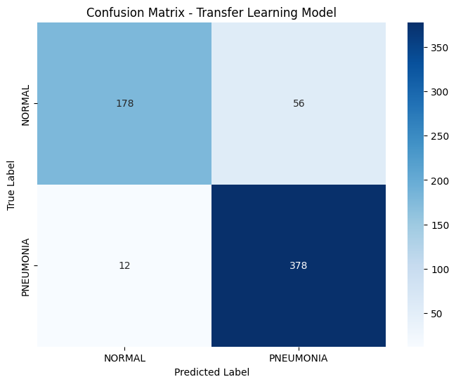
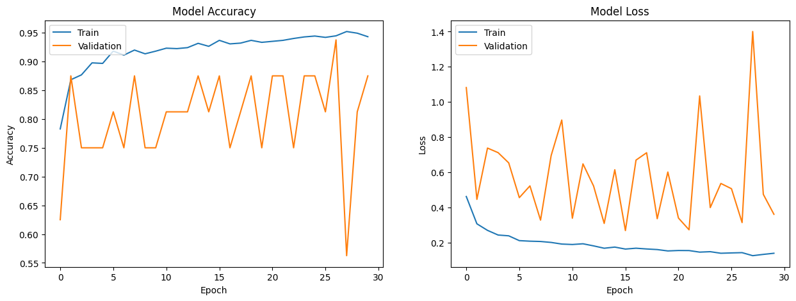

# Pneumonia Detection in Chest X-Rays using Transfer Learning

This project implements a CNN to classify chest X-ray images as either "Normal" or showing signs of "Pneumonia". It leverages the power of **transfer learning** with the **ResNet50** architecture pre-trained on the ImageNet dataset to achieve high accuracy on this medical imaging task.

The entire project is structured as a Google Colab notebook for easy execution and reproducibility.

---

## Getting Started

This project is designed to be run in a Google Colab environment to leverage free GPU resources.

### Prerequisites
- A Google Account to use Google Colab.
- A Kaggle Account to download the dataset via their API.

### Installation and Execution

1.  **Clone the Repository**
    ```bash
    git clone https://github.com/Trivial137/Machine-Learning_Longjie
    ```

2.  **Open in Google Colab**
    - Go to [Google Colab](https://colab.research.google.com/).
    - Click `File > Upload notebook`.
    - Upload the `pneumonia_detection.ipynb` file from the cloned repository.

3.  **Configure Kaggle API**
    - The notebook requires a Kaggle API token to download the dataset. Go to your Kaggle account page, scroll to the API section, and click **"Create Legacy API Key"** to download a `kaggle.json` file.
    - Run the first code cell in the notebook. It will prompt you to **upload the `kaggle.json` file** you just downloaded.

4.  **Run the Notebook**
    - Execute the cells sequentially from top to bottom.
    - Make sure to set the runtime type to **GPU** (`Runtime > Change runtime type > GPU`) for significantly faster training.

---

## Project Details

### Dataset
The project utilizes the "Chest X-Ray Images (Pneumonia)" dataset available on Kaggle.
*   **Link:** [https://www.kaggle.com/datasets/paultimothymooney/chest-xray-pneumonia](https://www.kaggle.com/datasets/paultimothymooney/chest-xray-pneumonia)
*   **Contents:** 5,863 JPEG images of chest X-rays.
*   **Classes:** `PNEUMONIA` and `NORMAL`.

### Methodology
The core of this project is **transfer learning**.
1.  **Pre-trained Base:** We use the `ResNet50` model, pre-trained on the ImageNet dataset, as a fixed feature extractor.
2.  **Freezing Layers:** The convolutional base of ResNet50 is "frozen" to preserve its learned feature representations.
3.  **Custom Classifier:** A new classifier "head" is added on top of the ResNet50 base. Only the weights of this new classifier are trained.
4.  **Data Augmentation:** To prevent overfitting, the training images are artificially augmented with random rotations, zooms, shifts, and flips.

### Tech Stack
- TensorFlow / Keras
- Scikit-learn
- NumPy
- Matplotlib & Seaborn
- Google Colab

---

## Results

After training, the model was evaluated on the unseen test set.

#### Performance Metrics

| Metric     | Score      |
| :--------- | :--------- |
| Test Accuracy   | **72.28%**   |
| Test Precision  | **71.23%**   |
| Test Recall     | **93.33%**   |
| Test Loss       | **0.5185**  |

#### Visualizations
The notebook generates key visualizations to interpret model performance.

**Confusion Matrix:** Shows the breakdown of correct and incorrect predictions.


**Training History:** Plots the accuracy and loss curves over epochs to check for overfitting.



---

<div align="center">

[](https://opensource.org/licenses/MIT)
[](https://www.tensorflow.org/)
[](https://keras.io/)

</div>
