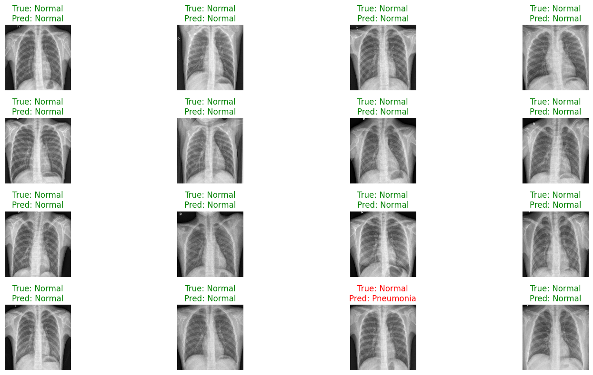

# Machine Learning

This repo serves as a project of the Lecture **Machine Learning**. 

---

## Getting Started

This project is designed to be run in a Google Colab.

### Prerequisites
- A Google Account to use Google Colab.
- A Kaggle Account to download the dataset via their API.

### Execution

1.  **Open in Google Colab**
    - Go to [Google Colab](https://colab.research.google.com/).
    - Click `File > Upload notebook`.
    - Upload the file.

2.  **Configure Kaggle API**
    - The notebook requires a Kaggle API token to download the dataset.
    - Run the first code cell in the notebook. It will prompt you to **upload the `kaggle.json` file**.

3.  **Run the Notebook**
    - Execute the cells sequentially from top to bottom.
    - Make sure to set the runtime type to **GPU**.

---

## Project Details

### Dataset
The project utilizes the "Chest X-Ray Images (Pneumonia)" dataset available on Kaggle.
*   **Link:** [https://www.kaggle.com/datasets/paultimothymooney/chest-xray-pneumonia](https://www.kaggle.com/datasets/paultimothymooney/chest-xray-pneumonia)
*   **Contents:** 5,863 JPEG images of chest X-rays.
*   **Classes:** `PNEUMONIA` and `NORMAL`.

### Methodology
The core of this project is **building with Transfered Learning with CNN**.
1.  **Transfer Learning:** We built a pre-trained VGG16 model (trained on ImageNet) as a feature extractor and added a custom classification head for binary classification.
2.  **Data Preparation:** Images are resized to **224x224** pixels for faster training and iteration.
3.  **Data Augmentation:** To prevent overfitting and teach robust feature learning, training images are augmented with random rotations, zooms, shifts, and horizontal flips.
---

## Results

After training, the model was evaluated on the unseen test set.

#### Performance Metrics

| Metric     | Score      |
| :--------- | :--------- |
| Test Accuracy   | **~84.29%**   |
| Test Precision  | **~81.20%**   |
| Test Recall     | **~97.44%**   |
| Test Loss       | **~0.3726**  |

#### Visualizations
The notebook generates key visualizations to interpret model performance.

**Confusion Matrix:** Shows the breakdown of correct and incorrect predictions.

**Training History:** Plots the accuracy and loss curves over epochs to check for overfitting.

**Test Images**: Display a few test images with their predicted labels

---

